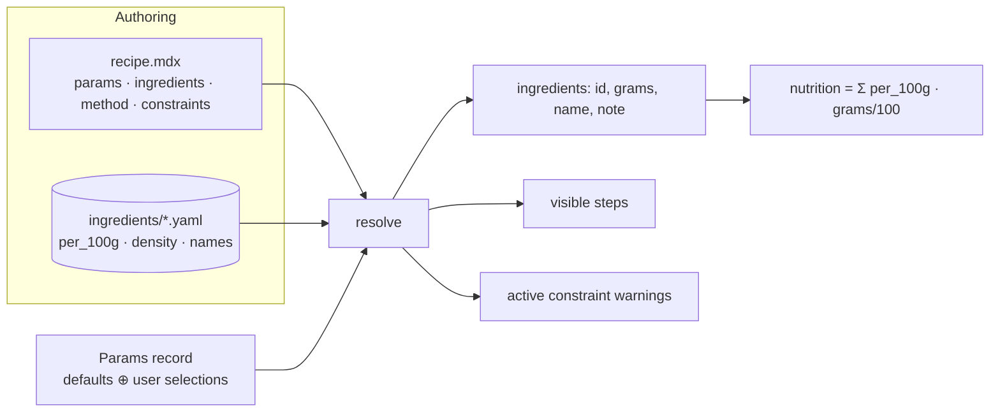

# Recipe model v2 — parameterised recipes

**Status:** design proposal (not yet implemented). Supersedes the flat
`base_ingredients` / `optional_ingredients` frontmatter once adopted.

## The one-sentence model

> A recipe is a **pure function** `R : Params → (ingredients : {id, grams}[]) × (steps : Step[])`.
> Nutrition is a **fold** of `per_100g · grams` over the resolved ingredient list.
> The ingredient DB is the **invariant nutrition oracle**, keyed by id.
> "Variants" / "modifiers" are just **named points in `Params`**.

Everything below is the concrete shape of `Params`, the recipe, and the
resolution function. The design deliberately keeps the two things the project
already values: **recipes authored as human-readable MDX with references into an
ingredient DB**, and **metric grams as the single source of truth** for all
nutrition math.

### Why a parameter *record* and not a fold of mutations

An earlier sketch modelled modifiers as composed functions `S → S` folded over a
base recipe. That leaks: function composition is associative but **not
commutative**, so two modifiers that touch the same ingredient (e.g. "extra
thick" scales the liquid ×0.8 while "use water" substitutes the liquid) give
different results depending on order — a real conflict, not a representation
artifact.

Making the recipe a function of the **final** parameter record removes order
entirely. There is no "apply A then B"; the recipe interprets one coherent
`Params` value, however the user arrived at it. Resolution is deterministic and
order-independent by construction.

## Invariants (carried over, non-negotiable)

1. **Metric grams are the source of truth.** `ml` is converted to grams via the
   ingredient's density before any nutrition math. `tsp`/`tbsp` remain a
   display-only hint derived from grams.
2. **Nutrition comes exclusively from USDA SR Legacy**, stored per-100g in the
   ingredient DB.
3. **Everything human-facing is bilingual `{ en, ja }`** — labels, notes,
   warnings, option names, and every method step.
4. **The default parameter point renders statically** (SSR), so a recipe is
   fully readable with JS disabled. Islands only *re-resolve* when the user
   changes a parameter — the same pattern the servings slider uses today.
5. **`servings` is not special — it is just the first parameter** (a scalar that
   ingredients are proportional to by default).

---

## Architecture



ASCII fallback:

```
 recipe.mdx ─┐
 ingredients ─┼─▶ resolve(recipe, db, Params) ─▶ { ingredients[], steps[], warnings[] }
 Params ──────┘                                          │
                                                         └─▶ nutrition = fold(per_100g · grams)
```

`Params = defaults` overlaid with the user's selections. Change any parameter →
re-run `resolve` → everything downstream recomputes. Pure, deterministic,
order-independent.

---

## Schema (normative TypeScript)

Shared primitives:

```ts
type Locale = 'en' | 'ja';
type Localized = Record<Locale, string>;
type Unit = 'g' | 'ml';
interface Amount { value: number; unit: Unit; }
interface Warning { type: 'avoid' | 'good'; en: string; ja: string; }
// NutritionFacts: the existing 12-nutrient per-100g shape.
```

### Ingredient DB (one file per id) — essentially unchanged

```ts
interface Ingredient {
  id: string;                          // == filename
  fdc_id: number;                      // USDA SR Legacy only
  names: Localized;
  aliases: Record<Locale, string[]>;
  nutrition: { per_100g: NutritionFacts };
  density_g_per_ml: number | null;     // required iff ever used with `ml`
}
```

The DB holds only **invariant facts** about a food. It knows nothing about any
recipe, amount, role, or variant. This is what keeps nutrition honest for *any*
parameter combination: resolution only ever multiplies these per-100g facts by a
gram quantity.

### Parameters — the recipe's interface

```ts
type Param = EnumParam | BoolParam | ScalarParam | SlotParam | MultiSelectParam;

interface BaseParam { label: Localized; }

// A closed choice that drives scaling/guards but isn't itself an ingredient.
interface EnumParam extends BaseParam {
  kind: 'enum';
  values: string[];
  default: string;
  optionLabels?: Record<string, Localized>;
}

interface BoolParam extends BaseParam { kind: 'bool'; default: boolean; }

// A continuous/stepped number. `servings` is the canonical instance.
interface ScalarParam extends BaseParam {
  kind: 'scalar';
  min: number; max: number; step?: number; default: number;
}

// A substitutable ingredient ROLE: pick exactly one option (radio semantics).
interface SlotParam extends BaseParam {
  kind: 'slot';
  options: SlotOption[];
  default: string;                     // an option id
}
interface SlotOption {
  id: string;                          // ingredient id in the DB
  amount?: Amount;                     // overrides the use-site amount for this option
  note?: Localized;                    // per-option timing/handling caveat
  warnings?: Warning[];
}

// An independent set of add-ons: each toggles on/off (the old "optional" axis).
interface MultiSelectParam extends BaseParam {
  kind: 'multiselect';
  options: MultiOption[];
}
interface MultiOption {
  id: string;
  amount: Amount;
  default: boolean;
  group?: Localized;                   // sub-heading, e.g. "Fruits" / "Toppings"
  note?: Localized;
  warnings?: Warning[];
}
```

`slot` is the **substitution** primitive (pick one — true radio semantics, which
plain multiselect can't express). `multiselect` is the **add** primitive and
subsumes today's `optional_ingredients` categories. `enum`/`bool`/`scalar` are
**knobs** that don't add ingredients but drive amounts and conditional steps.

### Ingredient uses — fixed or slot-backed

```ts
type IngredientUse = FixedUse | SlotUse;

interface CommonUse {
  amount: Amount;
  proportionalTo?: string;             // scalar param name; default 'servings'
  fixed?: boolean;                     // true => ignore servings scaling (a true constant)
  scale?: Record<string, number>;      // "<param>.<value>" -> multiplier (all matching entries multiply)
  group?: Localized;                   // sub-heading in the ingredient list
  note?: Localized;
  warnings?: Warning[];
}
interface FixedUse extends CommonUse { id: string; }     // a constant ingredient
interface SlotUse  extends CommonUse { slot: string; }   // resolves to the slot param's chosen id
```

`scale` is intentionally a **declarative table, not an expression** — `{ "thickness.extra": 1.5 }`
is inspectable and renderable ("Extra thick: chia ×1.5") without executing
anything. Arbitrary arithmetic in amounts is where authorability dies, so it is
disallowed; all amount variation is multipliers/overrides keyed by a parameter
value. (`servings` and any other scalar apply as a linear multiplier via
`proportionalTo`.)

### Method — prose with two affordances

```ts
interface Step {
  text: Localized;                     // may contain {slotName} tokens
  when?: string;                       // guard expression; absent = always shown
}
```

A step is a bilingual sentence. It may:

- carry a **guard** `when` (a boolean expression over params) — false ⇒ not rendered;
- interpolate a **slot token** `{liquid}` ⇒ the selected option's display name,
  and surface that option's `note` alongside the step.

That is the *entire* method algebra — no AST, no step-rewriting functions. This
is the single place the model crosses from prose into data, and it crosses
minimally, preserving readable, diffable, JS-off, bilingual steps. (Free-form
intro text and Tips stay as ordinary bilingual prose in the MDX body.)

### Constraints — explicit instead of silent nonsense

```ts
interface Constraint {
  when: string;                        // boolean expression over params
  warn?: Localized;                    // soft: show a caution
  error?: Localized;                   // hard: the combination is disallowed in the UI
}
```

The parameter space should be **total** where feasible (every point is a valid
dish) and **explicitly constrained** where not. You don't forbid "extra thick +
water"; you annotate it.

### Recipe

```ts
interface Recipe {
  title: Localized;
  slug: string;
  hero_image: string;
  locales: Locale[];
  params: Record<string, Param>;       // includes a 'servings' scalar by convention
  ingredients: IngredientUse[];
  method: Step[];
  constraints?: Constraint[];
  // bilingual intro/tips prose live in the MDX body, unchanged.
}
```

### Guard / constraint expression grammar

A small, safe boolean language over the param record (no `eval`):

```
expr  := or
or    := and ('||' and)*
and   := cmp ('&&' cmp)*
cmp   := unary (('==' | '!=' | '<' | '>' | '<=' | '>=') unary)?
unary := '!' unary | atom
atom  := paramName | literal | 'has(' paramName ',' string ')' | '(' expr ')'
literal := string | number | true | false
```

- `paramName` resolves to its value in `Params` (slots compare by option id).
- `has(toppings, 'walnuts')` tests membership of a `multiselect` selection.

The grammar is shared by step `when`, `constraint.when`, and the keys of `scale`
(which are the restricted `"<param>.<value>"` equality form).

---

## Resolution semantics

`resolve(recipe, db, P)` where `P` = defaults overlaid with user selections:

1. **Validate** `P` against each param's domain. Apply `error` constraints whose
   `when(P)` holds → the combination is rejected (the UI never offers it).
2. **Resolve each `IngredientUse` u → {id, grams, name, note, warnings}:**
   1. *id & base amount:* if `u` is a `SlotUse`, `id = P[u.slot]`, pick its
      `SlotOption`, base amount = `option.amount ?? u.amount`; else `id = u.id`,
      base amount = `u.amount`.
   2. *scale:* `m = ∏` of every `u.scale` entry whose `"<param>.<value>"` matches `P`.
   3. *proportional:* unless `u.fixed`, multiply by `P[u.proportionalTo ?? 'servings'] / default`.
   4. *to grams:* `ml → g` via `db[id].density_g_per_ml`.
3. **Resolve each selected `multiselect` option** the same way (steps 2.2–2.4).
4. **Nutrition** `= Σ scaleNutrition(db[id].per_100g, grams / 100)` over all
   emitted ingredients — a pure fold, honest for any `P`.
5. **Steps:** keep those with no `when` or `when(P) == true`; interpolate
   `{slot}` tokens to the chosen option's display name.
6. **Warnings:** collect `warn` constraints whose `when(P)` holds.

Order-independence falls out of step 2.2: multipliers commute, and nothing
depends on the *path* through parameter space, only the final `P`.

---

## Worked example A — overnight oats (thickness + liquid slot + toppings)

```yaml
params:
  servings: { kind: scalar, min: 1, max: 6, default: 1, label: { en: Servings, ja: 人数 } }
  thickness:
    kind: enum
    values: [classic, extra]
    default: classic
    label: { en: Thickness, ja: とろみ }
    optionLabels:
      classic: { en: Classic,     ja: クラシック }
      extra:   { en: Extra thick, ja: 濃厚 }
  liquid:
    kind: slot
    default: kefir
    label: { en: Liquid, ja: 液体 }
    options:
      - id: kefir
        note: { en: "Cultures keep working — tangier each day.", ja: "菌が生きていて日ごとに酸味が増す。" }
      - id: oat_milk
        amount: { value: 280, unit: ml }
        note: { en: "Dairy-free. Won't culture — eat within two days.", ja: "乳製品不使用。発酵しないので2日以内に。" }
      - id: water
        note: { en: "Most accessible; mildest flavour, looser set.", ja: "最も手軽。風味は穏やかで、固まりはゆるめ。" }
  toppings:
    kind: multiselect
    label: { en: Toppings, ja: トッピング }
    options:
      - { id: hemp_seeds, amount: { value: 15, unit: g }, default: true,  note: { en: "Complete protein.", ja: "完全タンパク質。" } }
      - { id: walnuts,    amount: { value: 15, unit: g }, default: false, note: { en: "Add just before eating.", ja: "食べる直前に。" } }

ingredients:
  - id: rolled_oats
    amount: { value: 35, unit: g }
  - id: chia_seeds
    amount: { value: 15, unit: g }
    scale: { thickness.extra: 1.5 }     # extra thick => more gel
  - slot: liquid
    amount: { value: 300, unit: ml }
    scale: { thickness.extra: 0.8 }     # extra thick => less liquid
  - id: salt
    amount: { value: 0.5, unit: g }

constraints:
  - when: thickness == extra && liquid == water
    warn: { en: "Water won't gel like kefir — the texture stays loose.", ja: "水はケフィアほど固まらず、ゆるめの食感になる。" }

method:
  - text: { en: "Combine oats and chia in a jar.", ja: "瓶にオーツとチアシードを入れる。" }
  - text: { en: "Pour in the {liquid}, stir, cover, and refrigerate overnight (6 h+).", ja: "{liquid}を注いで混ぜ、蓋をして一晩（6時間以上）冷蔵する。" }
  - when: liquid == oat_milk
    text: { en: "Oat milk doesn't culture — eat within two days.", ja: "オートミルクは発酵しないため2日以内に食べる。" }
  - text: { en: "Top with your choices and serve.", ja: "好みのトッピングをのせて食べる。" }
```

**Resolve `{ servings: 2, thickness: extra, liquid: oat_milk, toppings: [hemp_seeds] }`:**

- chia: `15 × 1.5 (extra) × 2 (servings) = 45 g`
- liquid: option `oat_milk` ⇒ base `280 ml` `× 0.8 (extra) × 2 = 448 ml` → `× density` → grams
- oats: `35 × 2 = 70 g`; salt: `0.5 × 2 = 1 g`; hemp seeds: `15 × 2 = 30 g`
- step 3 (oat-milk caveat) is shown; `{liquid}` → "oat milk" / "オートミルク"
- nutrition = fold over the five resolved ingredients

Switching `liquid` back to `kefir` drops step 3, restores the 300 ml base, and
recomputes nutrition — no other edits.

## Worked example B — the stew (protein slot)

The protein becomes a slot; lentils stay a fixed use (structural — they thicken
the broth); base sub-groups become `group` on each use. Sketch:

```yaml
params:
  servings: { kind: scalar, min: 1, max: 8, default: 4, label: { en: Servings, ja: 人数 } }
  protein:
    kind: slot
    default: tofu
    label: { en: Protein, ja: タンパク質 }
    options:
      - id: tofu
        note: { en: "Drain, no need to press; crumble in early.", ja: "水切りのみでOK。早めに崩し入れる。" }
      - id: chicken_breast
        amount: { value: 250, unit: g }
        note: { en: "Add with the vegetables; simmer 25 min until cooked through.", ja: "野菜と一緒に加え、火が通るまで25分煮る。" }
      - id: shrimp
        amount: { value: 200, unit: g }
        warnings:
          - { type: avoid, en: "⚠️ Don't add at the start — it turns rubbery.", ja: "⚠️ 最初に入れると硬くなる。" }
          - { type: good,  en: "✓ Stir in for the last 5 minutes only.", ja: "✓ 最後の5分だけ加える。" }

ingredients:
  - id: lentils                # fixed: always in, thickens the broth
    amount: { value: 96, unit: g }
    group: { en: Protein, ja: タンパク質 }
  - slot: protein
    amount: { value: 396, unit: g }     # default (tofu) amount; options override
    group: { en: Protein, ja: タンパク質 }
  # ... aromatics / seasonings / vegetables as fixed uses with `group` ...

method:
  - text: { en: "Sweat the aromatics in the oil.", ja: "油で香味野菜を炒める。" }
  - text: { en: "Add the lentils and {protein}; see its note for timing.", ja: "レンズ豆と{protein}を加える。タイミングは各メモを参照。" }
  # ... simmer, finish with greens ...
```

`{protein}` renders "tofu" / "chicken breast" / "shrimp" and surfaces that
option's timing note/warnings — the substitution-with-different-timing case,
handled without branching the numbered steps.

---

## What this subsumes / replaces

| Today | v2 |
| --- | --- |
| `servings_default` + servings slider | a `scalar` param named `servings` |
| `base_ingredients` (flat) | `ingredients` of `FixedUse`, optional `group` |
| `base_ingredients[].group` | same `group` field |
| `optional_ingredients` categories | a `multiselect` param per category |
| per-ingredient `warnings` (oats variety) | still per-use, plus `enum`/`slot` for true variants |
| (not expressible) substitution | `slot` param |
| (not expressible) cross-ingredient texture knob | `enum`/`scalar` + `scale` tables |
| (not expressible) conditional step | `Step.when` + `{slot}` tokens |

**Pay-as-you-go:** a recipe whose only param is `servings`, with all `FixedUse`
ingredients and unguarded steps, is exactly today's flat recipe. Parameters are
purely additive complexity — nothing forces a simple recipe to declare axes.

## Authoring via the skill

Recipes are generated by `recipe-from-youtube`, so the per-recipe design burden
(choosing sensible axes) lands on the skill + agent, not a human. The skill
should: detect when a cook frames a substitution ("you could use chicken") or a
texture/style knob ("make it extra thick") and model it as a `slot` / `enum`;
keep genuinely-always ingredients as `FixedUse`; and only introduce a parameter
when the video actually motivates it (don't invent axes).

## Open questions to settle before building

1. **Method location:** structured `method:` in frontmatter (shown above, cleanest
   for guards + bilingual tokens) vs. MDX `<Step when=…>` components compiling to
   the same `Step[]`. Frontmatter is the proposal; components are an ergonomic
   alternative if authors prefer prose-in-body.
2. **`error` constraints in a static build:** how to present a disallowed combo —
   disable the control, or allow-but-flag. Proposal: disable in the island; the
   default point is always valid so SSR is unaffected.
3. **Rounding/display** of scaled amounts (e.g. 448 ml) — reuse the existing
   `units.ts` hinting.
4. **Nutrition panel** with a `multiselect`/`slot`: it already sums the resolved
   list, so no new concept — just re-resolve on change.
